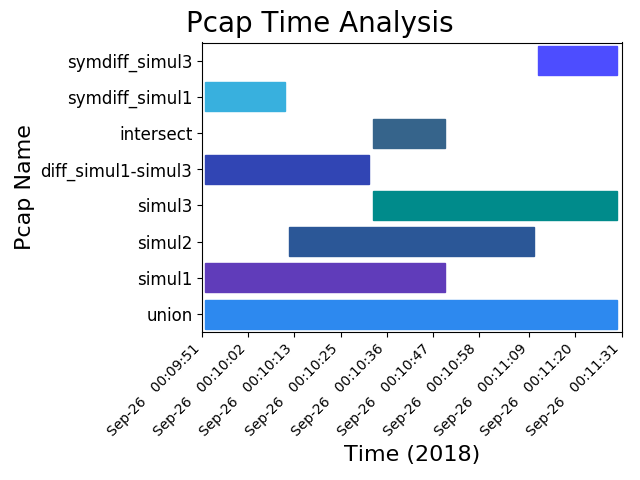

Examples
========

.pcap
-----
examples/ contains all packet captures used as examples.

The following will use 6 set operations to generate 11 pcaps. Note that the
last three should be empty because the intersect and timebounded intersect
are the same (i.e. 1 - 1 = 0).

.. code-block:: bash

    pcapgraph --dir examples -bdeisu --output pcap

Output
  | union.pcap
  | intersect.pcap
  | diff_simul1.pcap
  | symdiff_simul1.pcap
  | symdiff_simul3.pcap
  | timebounded_simul1.pcap
  | timebounded_simul2.pcap
  | timebounded_simul3.pcap
  | inv_timebounded_simul1.pcap
  | inv_timebounded_simul2.pcap
  | inv_timebounded_simul3.pcap

.png
----
Generated with ``pcapgraph --dir examples --dir examples/set_ops --output png``

This image contains all set operations at once. This is more of a demonstration
than anything else, as there isn't much of a use case to use all of them at the
same time.

----

.txt
----
Generated with ``pcapgraph -c --dir examples --output txt``

::

    PCAP NAME           DATE 0  DATE $     TIME 0    TIME $       UTC 0              UTC $
    (100%) simul1       Sep-26  Sep-26     00:09:52  00:10:49     1537945792.6673348 1537945849.9369159
    ( 66%) simul2       Sep-26  Sep-26     00:10:12  00:11:11     1537945812.7556646 1537945871.086899
    ( 31%) simul3       Sep-26  Sep-26     00:10:32  00:11:30     1537945832.8390837 1537945890.855496

