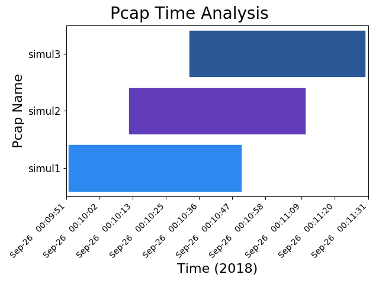

.. pcapgraph documentation master file, created by
   sphinx-quickstart on Wed Oct 10 02:59:44 2018.
   You can adapt this file completely to your liking, but it should at least
   contain the root `toctree` directive.

PcapGraph Manual
================
Create bar graphs out of packet capture timestamps.

About
-----

*Three packet captures taken of the same network traffic,
staggered by 20 seconds.*

Platforms
~~~~~~~~~
Linux, macOS, Windows

Description
~~~~~~~~~~~
PcapGraph is the tool you need for flow-based troubleshooting when you have
multiple packet captures. This tool creates a horizontal bar graph
that can be used for visualizing `pcaps <https://en.wikipedia.org/wiki/Pcap>`_.
It also uses set operations to find patterns among multiple packet
captures in ways that Wireshark is not able to. If an output format is not
specified, the default behavior is to print to stdout and send a
`matplotlib <https://matplotlib.org/>`_ graph to the screen (thus the name).

License
~~~~~~~
`Apache 2.0 <http://www.apache.org/licenses/LICENSE-2.0>`_

.. toctree::
   :maxdepth: 2
   :caption: Contents:

   install.rst
   cli.rst
   set_operations.rst
   pcap_timebounded.rst
   example_output.rst
   background.rst
   api.rst