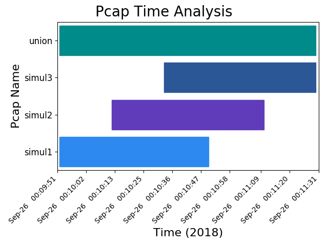
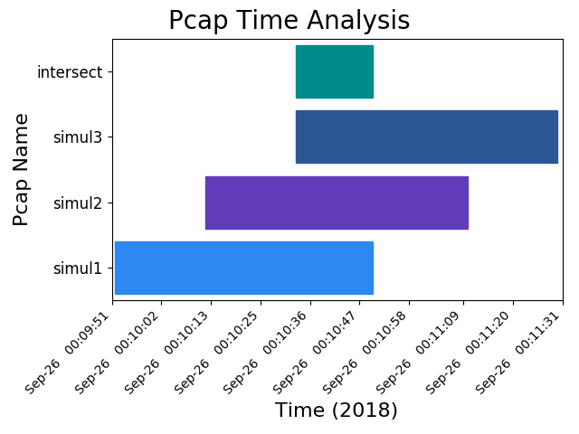
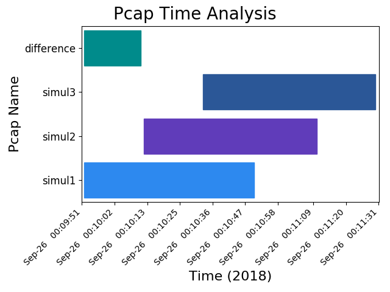
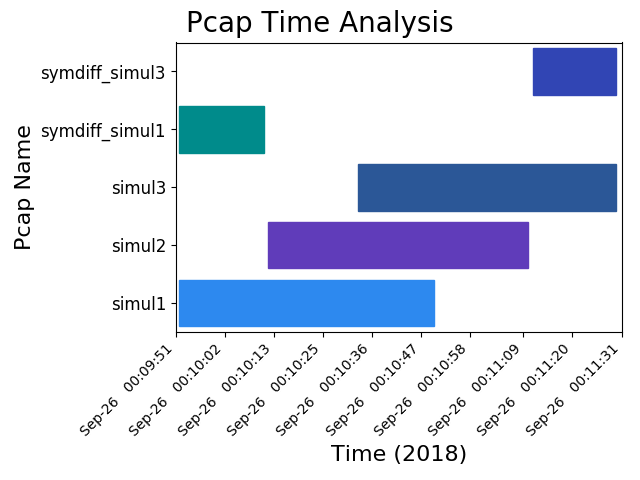

Set Operations
==============
All set operations use the raw frame's hex value to determine uniqueness.
This ensures that unless ARP traffic is involved (which has relatively few
fields), unique frames are going to be correctly identified as such.

.. tip:: These set operations are most useful when packet captures have
         already been filtered for the traffic that is most relevant.
         See `Pcap Preparation <pcap_preparation.html>`_ for more details.

----

.. code-block:: bash

    pcapgraph --dir examples --output png

.. image:: ../examples/pcap_graph.png

The three packet captures shown here serve as the basis for the
set operations below.

----

Union
-----
.. code-block:: bash

    pcapgraph --dir examples --union --output png

Union will include all unique packets, and so will include the first and last
packets of all captures.

Use case
~~~~~~~~
* For a packet capture that contains a broadcast storm, this function
  will find unique packets and packet counts. Knowing which packets are
  causing a broadcast storm may be useful in determining where there is a
  loop in the network. However, turning off the offending device is not
  likely to remove the loop and broadcast traffic is easy to come by.
* For any other situation where you need to find all unique packets.
* This function can be lossy with timestamps as duplicate packets
  are excluded so information can be lost.

.. tip:: If you want to combine pcaps without loss of duplicate packets,
         use mergecap instead.  mergecap is included by default in Wireshark
         installations.

         ``mergecap (<file>) [<file>...] -w union.pcap``

----

Intersection
------------
.. code-block:: bash

    pcapgraph --dir examples --intersect --output png

Find all packets that are shared between all packet captures.

Use Case
~~~~~~~~
* Taking the intersection of multiple packet captures can provide information
  on what traffic has made it through all relevant devices/interfaces.

----

Difference
----------
.. code-block:: bash

    pcapgraph --dir examples --difference --output png

Find all packets that are unique to the first packet capture.

Use Case
~~~~~~~~
* Taking the difference between two packet captures can help find traffic
  of interest that is present in one packet capture, but not another.

----

Symmetric Difference
--------------------
.. code-block:: bash

    pcapgraph --dir examples --symdiff --output png

The symmetric difference includes only unique packets from each packet capture.

Use Case
~~~~~~~~
If you have multiple packet captures in which you want to get all unique
packets exported on a per-packet capture basis.

Caveats
~~~~~~~
Symmetric Difference is included for sake of set operation completeness.
It is the equivalent to the set difference applied to all pcaps where each
pcap is at some point the pivot. If the difference contains no packets, it
is discarded.

Technically, this usage of symmetric difference is incorrect because it
produces multiple packet captures with unique packets instead of one
containing all of them.

----

Timebounded Intersection
------------------------
Description
~~~~~~~~~~~
It is sometimes useful when doing flow-based troubleshooting to find all
packets between the earliest shared frame and the latest shared frame.
It may also be useful to find all traffic that is between two timestamps.
These timebounded operations are built with, but are not bound by the
constraints of set operations.

Create a packet capture intersection out of two files by finding the first and
last instances of identical frames in multiple packet captures.

Example Operation
~~~~~~~~~~~~~~~~~
Let 2 packet captures have the following packets and assume that traffic
originates behind the device that Initial 1 is capturing on:

The algorithm will find that packet A is the earliest common packet
and that G is the latest common packet.

+-----------+-----------+-----------+----------------+----------------+
| Initial 1 | Initial 2 | Intersect | TB Intersect 1 | TB Intersect 2 |
+===========+===========+===========+================+================+
| A         | W         | A         | A              | A              |
+-----------+-----------+-----------+----------------+----------------+
| B         | X         | B         | B              | B              |
+-----------+-----------+-----------+----------------+----------------+
| C         | A         | C         | C              | F              |
+-----------+-----------+-----------+----------------+----------------+
| D         | B         | F         | D              | M              |
+-----------+-----------+-----------+----------------+----------------+
| E         | F         | G         | E              | C              |
+-----------+-----------+-----------+----------------+----------------+
| F         | M         |           | F              | G              |
+-----------+-----------+-----------+----------------+----------------+
| G         | C         |           | G              |                |
+-----------+-----------+-----------+----------------+----------------+
| H         | G         |           |                |                |
+-----------+-----------+-----------+----------------+----------------+
| I         | L         |           |                |                |
+-----------+-----------+-----------+----------------+----------------+

(TB = Timebounded)

.. note:: * In Pcap2, M does not exist in Pcap1
          * In Pcap2, C and F are out of order compared to Pcap1
          * The intersection does not include these interesting packets that
            are in one pcap, but note the other.

----

Inverse Timebounded Intersection
--------------------------------
Description
~~~~~~~~~~~
The difference of the intersection and the timebounded intersection for each
packet capture. By definition, the intersection and timebounded intersection
have the exact same starting and ending packets. What may be useful for
troubleshooting is determining in that timeframe which packets are different
across pcaps and why.

Example operation
~~~~~~~~~~~~~~~~~
+-----------+-----------+-----------+--------------------+--------------------+
| Initial 1 | Initial 2 | Intersect | Inv TB Intersect 1 | Inv TB Intersect 2 |
+===========+===========+===========+====================+====================+
| A         | W         | A         | D                  | M                  |
+-----------+-----------+-----------+--------------------+--------------------+
| B         | X         | B         | E                  |                    |
+-----------+-----------+-----------+--------------------+--------------------+
| C         | A         | C         |                    |                    |
+-----------+-----------+-----------+--------------------+--------------------+
| D         | B         | F         |                    |                    |
+-----------+-----------+-----------+--------------------+--------------------+
| E         | F         | G         |                    |                    |
+-----------+-----------+-----------+--------------------+--------------------+
| F         | M         |           |                    |                    |
+-----------+-----------+-----------+--------------------+--------------------+
| G         | C         |           |                    |                    |
+-----------+-----------+-----------+--------------------+--------------------+
| H         | G         |           |                    |                    |
+-----------+-----------+-----------+--------------------+--------------------+
| I         | L         |           |                    |                    |
+-----------+-----------+-----------+--------------------+--------------------+

(Inv TB = Inverse Timebounded)

The key here is to subtract the intersection from each initial packet capture
to find the interesting packets that are unique to each during the intersection
time period.